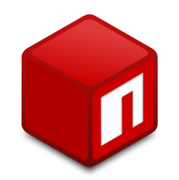

<!--
**gitdamnit/gitdamnit** is a ✨ _special_ ✨ repository because its `README.md` (this file) appears on your GitHub profile.

Here are some ideas to get you started:

- 🔭 I’m currently working on ...
- 🌱 I’m currently learning ...
- 👯 I’m looking to collaborate on ...
- 🤔 I’m looking for help with ...
- 💬 Ask me about ...
- 📫 How to reach me: ...
- 😄 Pronouns: ...

- ⚡ Fun fact: ...
-->

# Hi there 👋 I'm Evan. 

Critical thinker, builder, researcher, unapologetic tinkerer.

I design and build practical tools for real workflows — from HR decision-support and trainer software to ADHD-friendly productivity systems and smaller experimental apps. I’m especially interested in workflow design, AI-assisted systems, automation, and tools that make life a little bit easier. Also, I grow organic Meyer lemons. 

🔭 I’m currently working on ...

### 🚧 FRANKIE ⚠️ - Waiting for feedback
Application for personal trainers to optimize workflow and track clients.

### ADHDPenguin 🐧
Productivity dashboard built for chaotic brains, focused on organization, focus, and workflow support.

### ⭐ OPENCODE CHECKPOINT ORCHESTRATOR PLUGIN PASS ✅
Failure-resilient checkpointing for OpenCode — persistent task state, atomic writes, and resumable AI workflows.\

## Stack

Next.js • React • TypeScript • Python • Markdown • YAML • JSON • Node.js • PostgreSQL • Docker/Portainer • Cloudflare • Tailwind • Drizzle ORM • Llama.cpp • AI / LLM workflows

## Interests

Automation, data, workflow systems, applied AI, orchestration, writing, botany, and building (for the most part) useful weird shit.
